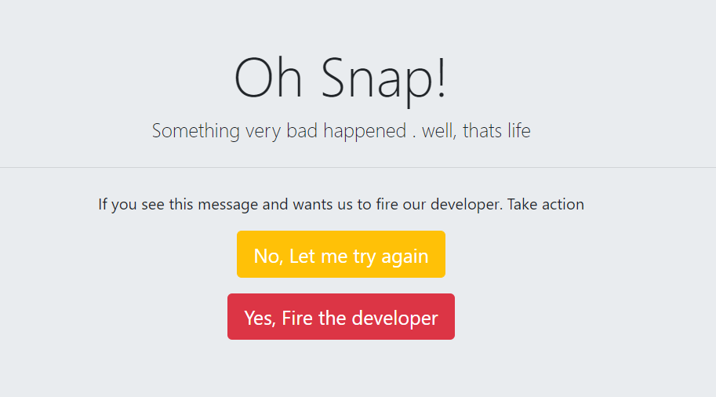

What its Does:
Newsletter Sign up subscribed form data to be posted directed to mailchimp list using mailchimp API and hosted on Heroku.

Technologies Used:
HTML5, CSS3, JavaScript ES6, NPM, Node.js, Express, body-parser, request, Heroku, etc

Demo: https://calm-fortress-94439.herokuapp.com/

How it works:
<ol>
<li>Sign-up form is created through Bootstrap</li>
<li>After setting up the environment and installing all the modules needed</li>
  <li>First Api key and list id was taken after looking at the mailchimp API so setup the account</li>
  <li>Once authenticated, Taking the entered user data, convert the JS object into JSON object using stringify</li>
  <li>Then at the end, setting up routes as to what happened on a certain action</li>
</ol>

